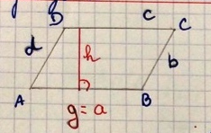
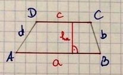

# Formeln zur Berechnung des Flächeninhalts und des Umfangs von Drei-und Vierecken

# Formulas para calcular el área y el perimetro de triangulos y cuadrados

## Vocabulario

- F: Flächeninhalts (área)
- g: grundlage (base/linea de abajo)
- h: höhe (altura)
- hc: Höhe zur seite c (altura para el lado c)
- ha: Höhe zur seite a (altura para el lado a)
- u: Umfang (Summe aller Begrenzungen der Fläche) (La suma de todos los limites de la superficie)

## Parallelogramm

`F = g · h`

`u = a + b + c + d`

also
    
     u= 2a + 2b (a = c und b = d)

## Trapez 

F = (a + c) · ha : 2

`u = a + b + c + d`
