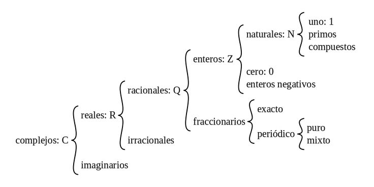

# Números racionales

Los números racionales son un conjunto de números que abarcan: 

- enteros (Z)
- - naturales (N) 
- - el cero (0)
- - [enteros negativos](../enteros-negativos/enteros-negativos.md)
- [fraccionarios](../brüchen)
- - exacto
- - periodico
- - - puro
- - - mixto
