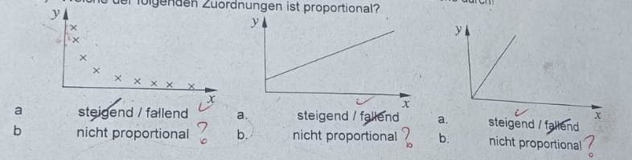
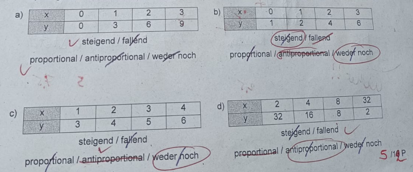
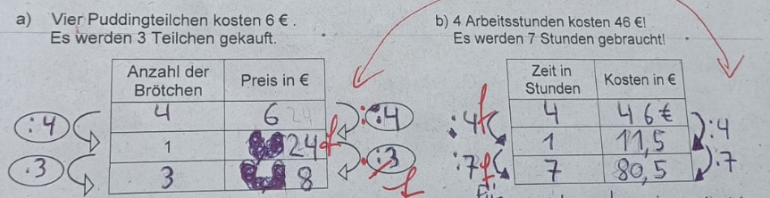
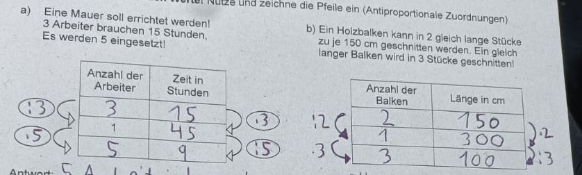
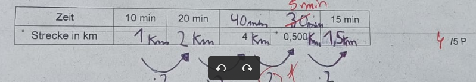

# Klassenarbeit Nr.3

## Zuordnungen

Bitte alle Ausrechnungen auf dem Bogen notieren, also aufschreiben, was du in den Taschenrechner eingibst!
Schreibe mit Tinte, zeichne mit Bleistift!

---

1. **Graphen**

    a) Welche der folgenden Zuordnungen ist steigend / fallend? Streiche durch!

    b) Welche der folgenden Zuordnungen ist proportional?

  

    c)  Begründe für je eine proportionale und eine nicht proportionale Zuordnung deine Entscheidungen!

    ---

2. **Wertetabellen**

    a) Welche Wertetabellen gehören fallenden / steigenden Zuordnungen?

    b) Welche Werttabellen gehören zu proportionalen oder antiproportionalen Zuordnungen?

    c) Begründen für je eine proportionale und eine antiproportionale Zuordnung deine entscheidungen!

3. **Vervollstädige:**

Für ________________ Zuordnungen gilt: Das Doppelte wird dem Doppeltenund das Vierfache dem __________ zugeordnet!
Für ________________ Zuordnungen gilt: Das Doppelte wird der ________, das Dreifache dem _________ und die Hälfte dem _________ zugeordnet!

4. Zeichne zur folgenden Tabelle einen graphen!

5. Berechne die fehlenden Werte! Nutze und zeichne die Pfeile ein! (Proportionale Zuordnungen)

 

Antwort:
 ______________________________________________________________________________________________

Antwort:
__________________________________________________________________________________________________

6. **Berechne die fehlenden Werte!** Nutze und zeichne die pfeile ein (Antiproportionale Zuordnungen)

Antwort:
___________________________________________________________________________________________________

Antwort:
___________________________________________________________________________________________________

7.**vervollständige die Tabelle!** Nebenrechnungen bitte ins Heft!

    Ein Wanderer geht in 10 Minuten 1 km. Es wird gleichbleibenden Geschwindigkeit angenommen!

Überlege bei der folgenden Aufgabe genau, um was für eine Zuordnung es sich handelt!

_Begründe_ dies und löse dann die Aufgabe, wenn möglich mit einer Tabelle!
Antwortsatz nicht vergessen!

8. Numerobis hat 15 Arbeiter für einen Steinbruch eingestellt. Für alle Arbeiter zusammen wird täglich Essen zur Verfügung gestellt: 2 kg Reis und ein Ziegenbraten. Die Arbeiten dauern 14 Tage. Wir groß müssen die Essensvorräte sein?

